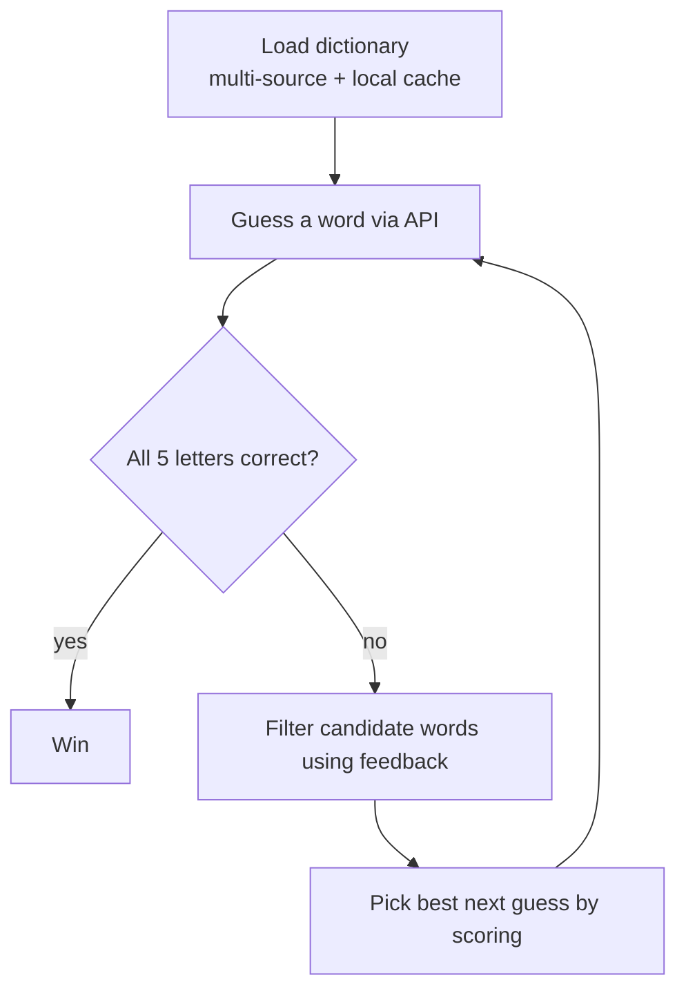

# Votee Wordle Solver (solver-v2.js)

An automated Node.js solver for the [Votee Wordle API](https://wordle.votee.dev:8000). It builds a dictionary of 5-letter words from multiple sources (cached locally), makes guesses against the API, interprets the per-letter feedback, narrows the candidate list, and picks each next guess using a positional letter-frequency heuristic.

---

## How It Works at a Glance



Each attempt follows the same cycle until the word is found or 6 attempts run out.

---

## API Specification

The solver targets OpenAPI 3.0.2 endpoints with query parameters:

| Endpoint | Method | Parameter | Type | Required | Description |
|---|---|---|---|---|---|
| `/random` | `GET` | `guess` | `string` | Yes | The 5-letter word attempt |
| | | `size` | `integer` | No | Target word length (default: `5`) |
| | | `seed` | `integer` | No | Session seed to lock the target word |

### Feedback Schema (`GuessResult[]`)

```json
[
  { "slot": 0, "guess": "t", "result": "absent"  },
  { "slot": 1, "guess": "a", "result": "present" },
  { "slot": 2, "guess": "r", "result": "correct" }
]
```

| `result` | Meaning |
|---|---|
| `correct` | The letter is at this exact position in the target word |
| `present` | The letter is in the target word, but at a different position |
| `absent`  | The letter is not in the target word |

The **`seed`** parameter locks the target word for the whole session — all guesses must send the same seed, otherwise the API would switch targets between attempts.

---

## Code Walkthrough

### `constructor(baseUrl, seed = 3, wordSize = 5)`

- Stores the API base URL, session seed, and target word length.
- Creates a reusable Axios instance (`apiClient`) with the base URL preconfigured and a **10-second timeout** on every request.

> The fixed default seed `3` means the solver replays the **same game** every run. Pass a different seed to play a different target word. The configurable `wordSize` lets the solver adapt to puzzles of other lengths — the dictionary filter and the API `size` parameter both follow it.

### `loadDictionary()` — multi-source dictionary with local cache

Dictionary words are merged from two sources, downloaded **in parallel** with `Promise.all`:

| Source | URL |
|---|---|
| tabatkins/wordle-list | `https://raw.githubusercontent.com/tabatkins/wordle-list/main/words` |
| dwyl/english-words | `https://raw.githubusercontent.com/dwyl/english-words/master/words_alpha.txt` |

Processing pipeline:

1. Both responses are split by newline, trimmed, and lowercased.
2. Words matching `^[a-z]{wordSize}$` (exactly 5 lowercase letters by default) are kept.
3. A `Set` deduplicates words across sources → merged pool of **20 148 words**.

**Caching:** the merged pool is saved as JSON to `cache/dictionary_5letters.json`. On subsequent runs the file is loaded directly — no download needed. Delete the cache file to force a fresh download. If the download fails, the script exits with an error.

### `makeGuess(guessWord)`

Sends `GET /random?guess=<word>&size=<wordSize>&seed=<seed>` through the shared Axios client and returns the feedback array. Any HTTP error or network failure prints a diagnostic and exits the process.

### `filterWords(feedback)` — the pruning logic

Feedback is pre-compiled into lookup structures so each remaining word can be tested in a **single pass**:

| Structure | Type | Holds |
|---|---|---|
| `exactPos` | `Array(wordSize)` | The confirmed letter at each position (`null` if unknown) |
| `wrongPos` | `Array(wordSize)` of `Set`s | Letters that **cannot** appear at each position (from `present` and `absent`) |
| `requiredChars` | `Set` | Letters that **must** appear somewhere in the word (from `correct` and `present`) |
| `forbiddenChars` | `Set` | Letters that cannot appear at all (from `absent`) |

**Feedback processing:**

- `correct` → record in `exactPos[slot]`, add to `requiredChars`
- `present` → ban from `wrongPos[slot]`, add to `requiredChars`
- `absent` → ban from `wrongPos[slot]`, add to `forbiddenChars`
- **Reconciliation:** any letter marked `correct`/`present` anywhere is removed from `forbiddenChars` — this guards against inconsistent API feedback (e.g. a letter reported `absent` in one slot while confirmed elsewhere).

**Filtering a candidate word:** it must satisfy all of

1. Every `exactPos[i]` letter matches at position `i`.
2. No position contains a letter banned there by `wrongPos[i]`.
3. It contains no letter from `forbiddenChars`.
4. It contains every letter from `requiredChars`.
5. For letters confirmed in multiple `correct` slots, its count is at least the number of distinct `correct` slots (`correctCounts`) — so duplicated letters are handled correctly.

### `getBestGuess()` — the scoring heuristic

When more than 2 candidates remain, the solver picks the guess that should eliminate the most candidates:

1. Builds a **position-frequency matrix** `posFreq[i][char]` — how many remaining candidates have each letter at each position.
2. Builds overall **letter frequencies** across all candidates.
3. Scores every candidate:

   ```
   score = Σ posFreq[i][word[i]]            // positional likelihood
         + Σ 1.5 × letterFreq[char]         // unique-letter discovery (counted once per letter)
   ```

   The 1.5× weight rewards words with **distinct letters**, which reveal information about more letters at once. The highest-scoring word is returned.

With ≤ 2 candidates the solver just guesses the first one — scoring is pointless when the list is nearly empty.

### `play()` — the main loop

1. Loads the dictionary (from cache when available).
2. For up to 6 attempts:
   - **Attempt 1:** uses the fixed opener `"salet"` when the word size is 5 and the word is in the dictionary; otherwise falls back to `getBestGuess()`.
   - Submits the guess and checks whether **all** results are `correct` → win.
   - Otherwise calls `filterWords()` and prints how many candidates remain (listing them when ≤ 5).
3. Prints ❌ if 6 attempts pass without a win.

### Script bootstrap (bottom of the file)

```js
const API_BASE_URL = 'https://wordle.votee.dev:8000';
const solver = new WordleSolver(API_BASE_URL, 3, 5);   // baseUrl, seed, wordSize

solver.play();
```

---

## Differences from solver-v1.js

| Aspect | v1 (`solver-v1.js`) | v2 (`solver-v2.js`) |
|---|---|---|
| Dictionary | Single source (darkermango/5-Letter-words) | Two sources merged (`tabatkins/wordle-list` + `dwyl/english-words`), deduplicated |
| Local cache | None — downloads every run | `cache/dictionary_5letters.json` |
| Seed | Random per run (`Math.random()`) | Fixed default `3` — deterministic replay |
| Word length | Hardcoded `5` | Configurable via `wordSize` (default 5) |
| Opener | `"crane"`, else first dictionary word | `"salet"` (when wordSize = 5), else `getBestGuess()` |
| Next-guess pick | Always `possibleWords[0]` | Positional + frequency scoring (`getBestGuess`) |
| Filtering | `charBounds` min/max count constraints | `requiredChars` / `forbiddenChars` sets + positional lookups + duplicate-count check |
| API feedback quirks | Not handled | Reconciliation step removes `required` letters from `forbidden` |
| HTTP client | New `axios.get` call each time | Shared Axios instance with base URL + 10 s timeout |
| Feedback logging | Prints raw feedback per attempt | Commented out |

v2 trades a little simplicity for a larger vocabulary, robustness against inconsistent feedback, and faster repeated runs thanks to caching.

---

## Requirements

- [Node.js](https://nodejs.org/) (any recent LTS version)
- An internet connection for the first run (dictionary download) and for every guess (the game API)

## How to Run

```bash
# 1. Install dependencies (axios)
npm install

# 2. Run the solver — either command works:
node solver-v2.js
npm start        # package.json maps start to node solver-v2.js
```

The first run downloads and merges the dictionaries (~20 k words) into `cache/dictionary_5letters.json`; subsequent runs load from that cache. Delete the cache file to re-download.

## Sample Output

First run (download + merge):

```
📥 Downloading and merging multi-source dictionaries...
Saved clean JSON cache (20148 words) to: /Users/vothitruongan/Desktop/Votee/votee/cache/dictionary_5letters.json
Loaded 20148 words. Session Seed: 3

Attempt 1/6: Guessing "SALET"...
   -> Remaining possible words: 1477
Attempt 2/6: Guessing "COINY"...
   -> Remaining possible words: 82
Attempt 3/6: Guessing "PURDY"...
   -> Remaining possible words: 7
Attempt 4/6: Guessing "FURRY"...
   -> Remaining possible words: 1
   -> Candidates: murky
Attempt 5/6: Guessing "MURKY"...

🎉 Success! The word is "MURKY" (Found in 5 attempts)
```

Subsequent runs (cache hit):

```
⚡ Loading pre-processed 5-letter dictionary from cache...
Loaded 20148 words. Session Seed: 3

Attempt 1/6: Guessing "SALET"...
...
```

## Configuration

All knobs are at the bottom of `solver-v2.js`:

- **`API_BASE_URL`** — the game server (line 238).
- **`seed`** — constructor argument, default `3`; e.g. `new WordleSolver(API_BASE_URL, 12345, 5)` plays a different fixed word.
- **`wordSize`** — constructor argument, default `5`; changes both the dictionary filter and the API `size` parameter.
- **Opener word** — the `"salet"` literal in `play()` (only used when `wordSize === 5`).
- **`maxAttempts`** — attempt limit in `play()` (default 6).
- **`DICTIONARY_URLS`** — the dictionary sources merged at startup (lines 6–9).

## Credits

- **Algorithm design** — researched and developed with the help of [Gemini](https://gemini.google.com).
- **README.md** — created with [DeepSeek](https://www.deepseek.com) and [Claude CLI](https://claude.ai).
- **Word dictionary** — v2 merges 5-letter English word lists from [tabatkins/wordle-list](https://raw.githubusercontent.com/tabatkins/wordle-list/main/words) and [dwyl/english-words](https://raw.githubusercontent.com/dwyl/english-words/master/words_alpha.txt); v1 uses [darkermango/5-Letter-words](https://raw.githubusercontent.com/darkermango/5-Letter-words/main/words.txt).
