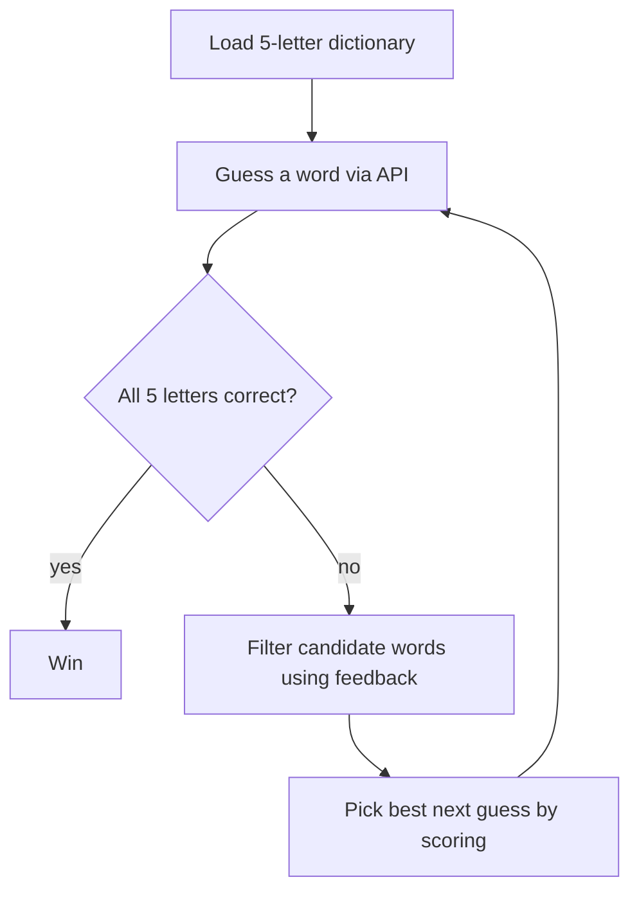

# Votee Wordle Solver (resolver-v2.js)

An automated Node.js solver for the [Votee Wordle API](https://wordle.votee.dev:8000). It downloads a dictionary of 5-letter words, makes guesses against the API, interprets the per-letter feedback, narrows the candidate list, and picks each next guess using a positional letter-frequency heuristic.

---

## How It Works at a Glance



Each attempt follows the same cycle until the word is found or 6 attempts run out.

---

## API Specification

The solver targets OpenAPI 3.0.2 endpoints with query parameters:

| Endpoint | Method | Parameter | Type | Required | Description |
|---|---|---|---|---|---|
| `/random` | `GET` | `guess` | `string` | Yes | The 5-letter word attempt |
| | | `size` | `integer` | No | Target word length (default: `5`) |
| | | `seed` | `integer` | No | Session seed to lock the target word |

### Feedback Schema (`GuessResult[]`)

```json
[
  { "slot": 0, "guess": "t", "result": "absent"  },
  { "slot": 1, "guess": "a", "result": "present" },
  { "slot": 2, "guess": "r", "result": "correct" }
]
```

| `result` | Meaning |
|---|---|
| `correct` | The letter is at this exact position in the target word |
| `present` | The letter is in the target word, but at a different position |
| `absent`  | The letter is not in the target word (beyond any confirmed occurrences) |

The **`seed`** parameter locks the target word for the whole session — all guesses must send the same seed, otherwise the API would switch targets between attempts.

---

## Code Walkthrough

### `constructor(baseUrl, seed = 10)`

- Stores the API base URL and session seed.
- Creates a reusable Axios instance (`apiClient`) with the base URL preconfigured and a **10-second timeout** on every request.

> The fixed default seed `10` means the solver replays the **same game** every run. Pass a different seed to play a different target word.

### `loadDictionary()`

Downloads the word list from `DICTIONARY_URL` (the `darkermango/5-Letter-words` repository on GitHub), then:

1. Splits the response by newline.
2. Trims whitespace and lowercases every word.
3. Keeps only words of exactly 5 characters.

Result: `possibleWords` — the full candidate pool (5757 words). If the download fails, the script exits with an error.

### `makeGuess(guessWord)`

Sends `GET /random?guess=<word>&size=5&seed=<seed>` through the shared Axios client and returns the feedback array. Any HTTP error or network failure prints a diagnostic and exits the process.

### `filterWords(feedback)` — the pruning logic

This is the heart of the solver. Feedback is pre-compiled into three structures so each remaining word can be tested in a **single pass**:

| Structure | Type | Holds |
|---|---|---|
| `exactPos` | `Array(5)` | The confirmed letter at each position (`null` if unknown) |
| `wrongPos` | `Array(5)` of `Set`s | Letters that **cannot** appear at each position (from `present` and `absent`) |
| `charBounds` | `Object` | Per-letter `{ min, max }` count constraints |

**Bounds logic for duplicated letters:**

- `correct` → `min + 1` (at least one more occurrence of that letter exists)
- `present` → `min + 1` (the letter exists, just not here)
- `absent` → `max = min` (caps occurrences at what's already confirmed — this is what makes repeated letters like `aa` handled correctly)

**Filtering a candidate word:** it must satisfy

1. Every `exactPos[i]` letter matches at position `i`.
2. No position contains a letter banned there by `wrongPos[i]`.
3. For every letter with bounds, its count in the word is within `[min, max]`.

### `getBestGuess()` — the scoring heuristic

When more than 2 candidates remain, the solver picks the guess that should eliminate the most candidates:

1. Builds a **position-frequency matrix** `posFreq[i][char]` — how many remaining candidates have each letter at each position.
2. Builds overall **letter frequencies** across all candidates.
3. Scores every candidate:

   ```
   score = Σ posFreq[i][word[i]]            // positional likelihood
         + Σ 1.5 × letterFreq[char]         // unique-letter discovery (counted once per letter)
   ```

   The 1.5× weight rewards words with **distinct letters**, which reveal information about more letters at once. The highest-scoring word is returned.

With ≤ 2 candidates the solver just guesses the first one — scoring is pointless when the list is nearly empty.

### `play()` — the main loop

1. Loads the dictionary.
2. For up to 6 attempts:
   - **Attempt 1:** uses the fixed opener `"salet"` if it exists in the dictionary; otherwise falls back to `getBestGuess()` (e.g. it opens with `TARES` here, since `salet` is not in this word list).
   - Submits the guess and checks whether **all** 5 results are `correct` → win.
   - Otherwise calls `filterWords()` and prints how many candidates remain (listing them when ≤ 5).
3. Prints ❌ if 6 attempts pass without a win.

### Script bootstrap (bottom of the file)

```js
const API_BASE_URL = 'https://wordle.votee.dev:8000';
const solver = new WordleSolver(API_BASE_URL);   // seed defaults to 10

solver.play();
```

---

## Differences from resolver-v1.js

| Aspect | v1 | v2 |
|---|---|---|
| Seed | Random per run (`Math.random()`) | Fixed default `10` — deterministic replay |
| Opener | `"crane"`, else first dictionary word | `"salet"`, else `getBestGuess()` |
| Next-guess pick | Always `possibleWords[0]` | Positional + frequency scoring (`getBestGuess`) |
| Filtering | Re-scans feedback array per word | Pre-compiled `exactPos` / `wrongPos` lookups (single pass) |
| HTTP client | New `axios.get` call each time | Shared Axios instance with base URL + 10 s timeout |

v2 trades a little simplicity for better guess quality and faster filtering.

---

## Requirements

- [Node.js](https://nodejs.org/) (any recent LTS version)
- An internet connection (the dictionary and the game API are both remote)

## How to Run

```bash
# 1. Install dependencies (axios)
npm install

# 2. Run the solver — either command works:
node resolver-v2.js
npm start        # package.json maps start to node resolver-v2.js
```

## Sample Output

```
Downloading 5-letter English dictionary...
Loaded 5757 words. Session Seed: 10

Attempt 1/6: Guessing "TARES"...
   -> Remaining possible words: 102
Attempt 2/6: Guessing "BRAND"...
   -> Remaining possible words: 3
   -> Candidates: organ, groan, argon
Attempt 3/6: Guessing "ORGAN"...
   -> Remaining possible words: 1
   -> Candidates: groan
Attempt 4/6: Guessing "GROAN"...

🎉 Success! The word is "GROAN" (Found in 4 attempts)
```

## Configuration

All knobs are at the bottom of `resolver-v2.js`:

- **`API_BASE_URL`** — the game server (line 211).
- **`seed`** — `new WordleSolver(API_BASE_URL, 12345)` to play a different fixed word, or replace the constructor default (`10`) with a random value for a fresh game each run.
- **Opener word** — the `"salet"` literal in `play()`.
- **`maxAttempts`** — attempt limit in `play()` (default 6).
